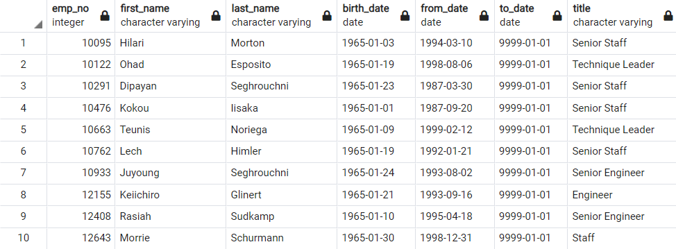

# Pewlett Hackard Analysis
## Overview
### Background
The current project was done for the very large and longstanding company Pewlett Hackard. As members of the large generation of "Baby Boomers" begin to retire, Pewlitt Hackard wants to prepare for their subsequent vacancies. 

### Purpose
The purpose of this analysis was to determine the number of retiring employees per title and to identify current employees who are eligible to particiapte in a mentorship program. The analysis was conducted using SQL. Full results tables can be found in the "Data" folder. 

## Results
### Retirees
A list of employees that will be retiring was created by selecting employees who were born between January 1, 1952 and December 31, 1955. Because some employees have held multiple titles, another similar table was created that only listed the most recent title of each retiring employee. These individuals were grouped by title and tallied to produce the results below: 

**Retiring Titles**

### Mentors 
A table of employees who are eligible to be mentors was created by selecting current employees who were bron between January 1, 1965 and December 31, 1965. In total, there are 1,549 current employees that are eligible for the mentorship program. The beginning of the table can be seen below. 

**Mentorship Eligibility**

## Summary 
Based on the original analysis of unique titles of those who are retiring, one may conclude that 90,398 employees are retiring. However, this analysis did not account for the fact that some of the retiring employees may not work for Pewlitt Hackard anymore. Because of this, an extra analysis was done which selected only those who are currently employed at Pewlett Hackard. This resulted in the table below: 

**Currently Employed Retiring Titles**

As one can see, the number of roles that need to be filled is actually 72,458. However, there are only 1,549 employees who are eligible for the mentorship program. If the number of roles to be filled is divided by the number of available mentors, that would equal roughly 47 roles per mentor. Based on these results it can be concluded that Pewlett Hackard does not have enough mentors. 

Two additional queries were executed for a slightly different breakdown of the data. The first query was used to determine the number of retirees per department, and the second query determined the number of employees eligible for the mentorship program per department. Tables containing the results of these analyses are below: 

**Retirees by Department**

**Mentors by Department**

